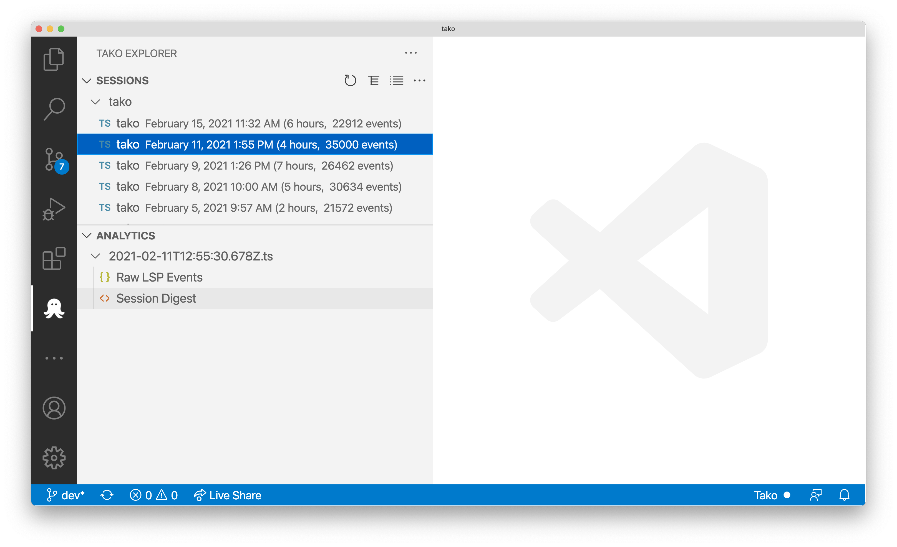
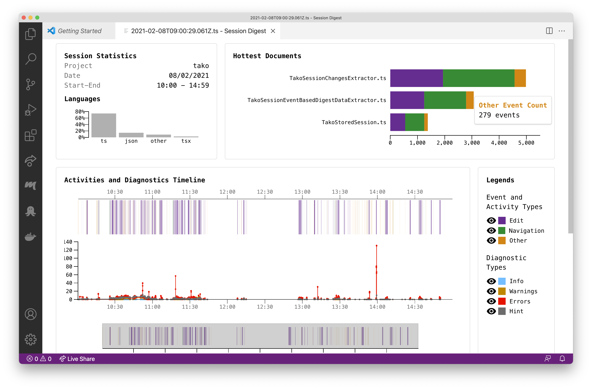
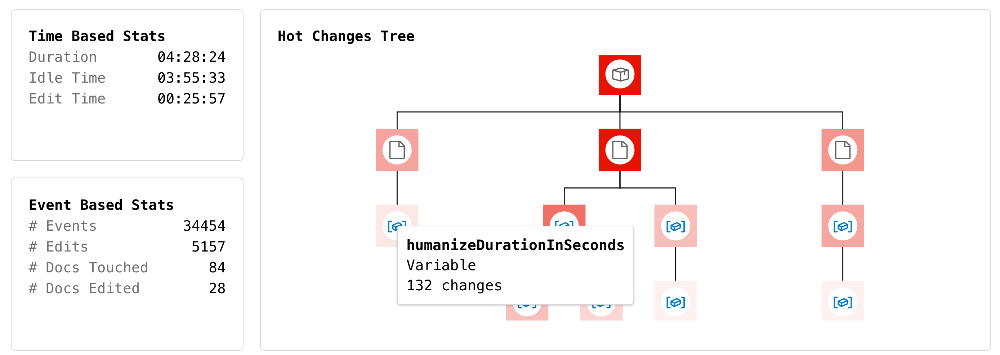

# Tako for Visual Studio Code

Tako is an extension for [Visual Studio Code] (VS Code) that records many aspects of your programming activity and provides a digest to allow some self-reflection on what you have done, how you spent your time, and which entities you worked on. 

Currently, Tako supports in principle any language the features of which are exposed through the [Language Server Protocol][lsp] (e.g., [Scala][scala] through [Metals][metals]), plus Typescript/Javascript. We plan to extend the set of supported languages in future versions of Tako.

**Privacy Notice:** *Tako does not share your data with any remote server. All the data is stored locally and it is under your full control. All the analyses are performed on your local machine.*

Tako has been developed by [CodeLounge] @ [Software Institute][usi-si] — [USI, Lugano][usi], under the support of the [Hasler Foundation][hf].

## Installation

Tako is available on the [Visual Studio Extensions Marketplace][vs-marketplace]. To install it, you can either:

* Visit [dedicated page][tako-marketplace] on the Marketplace and press the `Install` button, or

* Follow these steps inside VS Code:
  * Press `F1` (or `⌘ + Shift + P`)
  * Type `install`
  * Pick `Extensions: Install Extension`
  * Type `tako` and hit `enter`
  * Press the `Install` button  

## UI and Usage

The first time you run Tako, it will ask you to allow recording your programming sessions. From that moment on, Tako will silently record many events happening in VS Code. 

### Status Bar
You can always check the recording status of Tako in the status bar:  

### Tako Explorer & Analytics
To explore the recorded sessions, open the Tako explorer by clicking on the Tako icon inthe activity bar. On the top of the view, you can find the list of sessions grouped by the workspace name. Each session shows its starting time, its duration, and the number of recorded events. Smaller sessions are hidden by default. By clicking on a session, the lower part of the view shows the list of available analytics. 

Currently, you can access the following analytics:
* List of  `Raw LSP Events` in JSON format;
* `Session Digest`.

#### Session Digest
The session digest, inspired by [Minelli et al.][free-hugs], is the main analytics view provided by Tako. In the digest, you can inspect some basic session statistics, the hottest document section, the timeline, and the hot changes tree. 

The hottest document section, highlights the top 3 documents according to the number of events. Events are grouped by their type: *Edit* events, *Navigation* events (*e.g.,* when moving from one method to another one), and *Other* events (*e.g.,* setting a breakpoint in the debugger).

The timeline shows how events are distributed over time together with a chart which shows the amount of active diagnostics (*e.g.,* errors and warnings). 

The last part of the session digest shows the hot changes tree and some other statistics. The hot changes tree visualizes the files and program entities which were most involved in edit events. By hovering on a node of the tree, you can inspect its name, type, and number of changes. This will give you a hint on what the session was about.

## Configuring Tako

Tako specific configuration settings are available in a dedicated section that you can access with `⌘ + ,`, then typing `tako` on the Search settings. At the moment, you can change your consent to recording (and thus disable/enable it), and change the minimal size of sessions to show in the Tako explorer.

## Support

If you find problems and bugs, please submit an [issue](https://github.com/si-codelounge/tako/issues) on the public GitHub repository.

[Visual Studio Code]: https://code.visualstudio.com/
[CodeLounge]: https://codelounge.si.usi.ch
[usi-si]: https://www.si.usi.ch
[usi]: https://www.usi.ch/en
[vs-marketplace]: https://marketplace.visualstudio.com/vscode
[tako-marketplace]: https://marketplace.visualstudio.com/items?itemName=codelounge.tako
[free-hugs]: https://robertominelli.com/downloads/Mine2015a.pdf
[hf]: https://haslerstiftung.ch/en/welcome-to-the-hasler-foundation/
[lsp]: https://microsoft.github.io/language-server-protocol/
[scala]: https://www.scala-lang.org
[metals]: https://scalameta.org/metals/